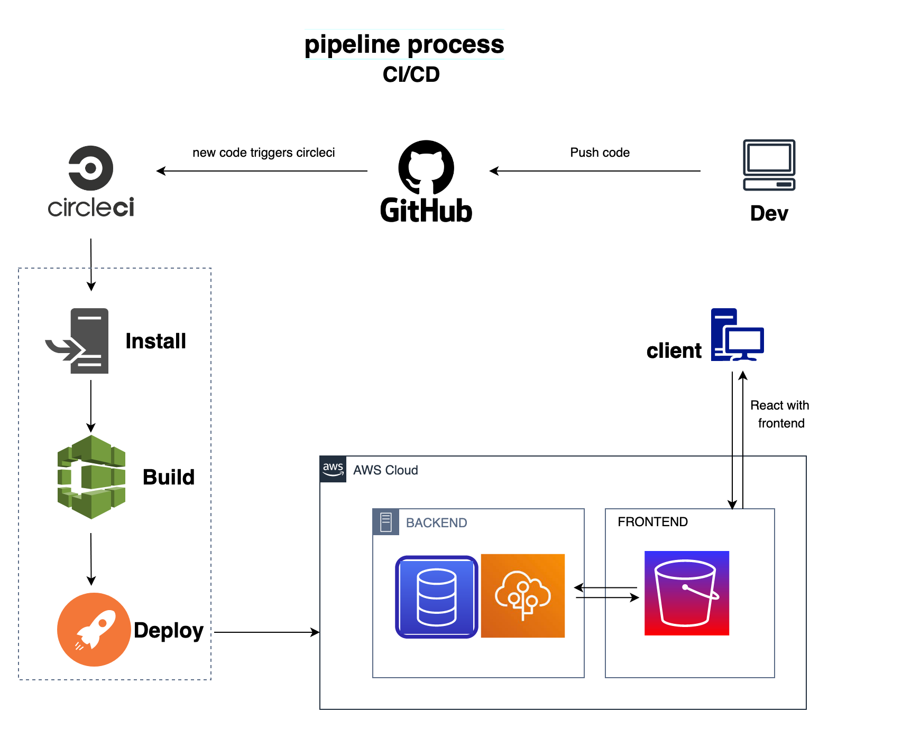

# Pipeline CI/CD process
CircleCi detects any change in code on the main repo, then install dependencies on EB and Configure AWS Credentials and then build the backend and deploy it on the server.
It does the same in the s3 frontend, installing dependencies, building the frontend, and deploying it.

