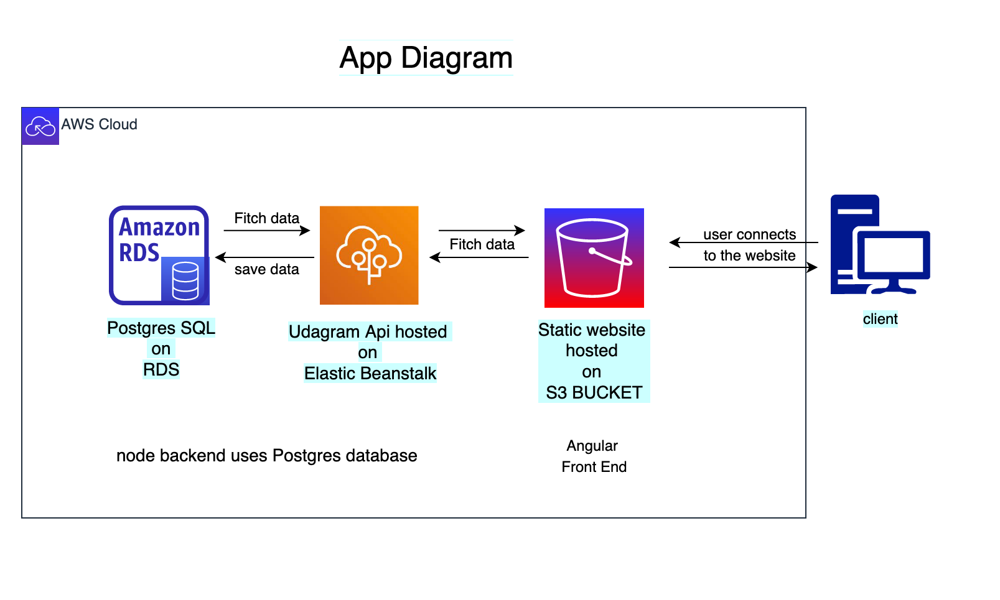

# Project overview
We use AWS services to host this app.
RDS hosts Postgres database, the server runs on Elastic Beanstalk using the database, and S3 hosts static frontend.
- [Database url](postgres4.cplggzy7pjgw.us-east-1.rds.amazonaws.com): postgres4.cplggzy7pjgw.us-east-1.rds.amazonaws.com
- [EB url](http://waeludagram4-env.eba-t7y9pmzk.us-east-1.elasticbeanstalk.com/): http://waeludagram4-env.eba-t7y9pmzk.us-east-1.elasticbeanstalk.com/
- [S3 url](http://wael1stbuket.s3-website-us-east-1.amazonaws.com): http://wael1stbuket.s3-website-us-east-1.amazonaws.com

